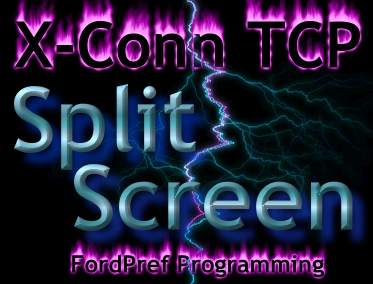



## X\-Conn TCP Split\-Screen Mode

### Description

* UPDATED * Thanks to David Pope, I've got the backspace bug repaired. This is a "on the fly" chat program, complete with sound effects, stay on top option, all the bells and whistles. Sequel to "X-Conn TCP Chat." This is an ICQ split-screen style chat program. Hope you like it. If there are any other bugs, please let me know... THANKS!
 
### More Info
 

             |
---                |---
**Submitted On**   |2000-08-06 19:38:36
**By**             |[N/A](https://github.com/Planet-Source-Code/PSCIndex/blob/master/ByAuthor/empty.md)
**Level**          |Beginner
**User Rating**    |5.0 (15 globes from 3 users)
**Compatibility**  |VB 4\.0 \(32\-bit\), VB 5\.0, VB 6\.0
**Category**       |[Internet/ HTML](https://github.com/Planet-Source-Code/PSCIndex/blob/master/ByCategory/internet-html__1-34.md)
**World**          |[Visual Basic](https://github.com/Planet-Source-Code/PSCIndex/blob/master/ByWorld/visual-basic.md)
**Archive File**   |[CODE\_UPLOAD8681862000\.zip](https://github.com/Planet-Source-Code/x-conn-tcp-split-screen-mode__1-10397/archive/master.zip)

